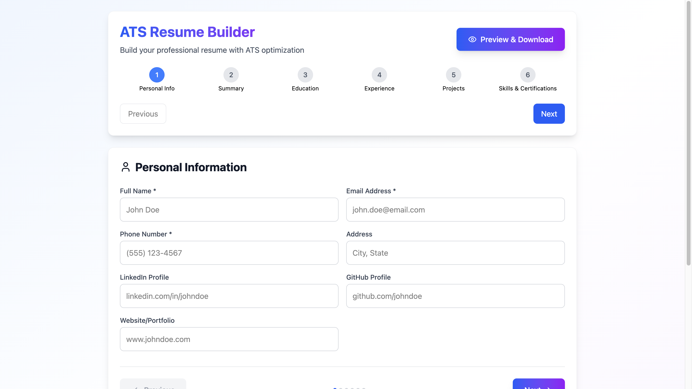
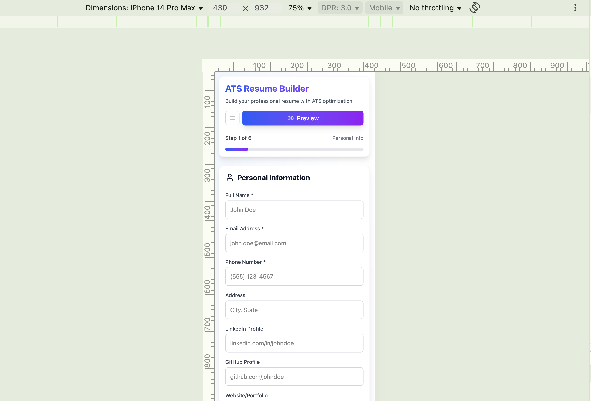

# 🚀 ATS Resume Builder

Build your professional resume with **ATS (Applicant Tracking System) optimization**. This web app helps job seekers create a clean, structured, and easily scannable resume with multiple steps, live preview, and PDF download support.

## ✨ Features

- Multi-step form (Personal Info, Summary, Education, Experience, Projects, Skills)
- Responsive design (Mobile & Desktop optimized)
- ATS-friendly structure
- Live Preview & Download as PDF
- LocalStorage support to auto-save progress
- Built with React.js & Tailwind CSS

---

## ScreenRecord
1[Screen Record](./src/screen-record/intern-record.mp4)

## 📱 Screenshots

### 🖥️ Desktop View  


### 📱 Mobile View (iPhone 14 Pro Max)  


> Make sure these screenshots are placed in a `screenshots/` folder in your repo

---

##  Tech Stack

- React.js
- Tailwind CSS
- React Hooks (`useState`, `useEffect`)
- LocalStorage API

---

## 🚀 Getting Started

### 1. Clone the Repository
```bash
git clone https://github.com/S-Vignesh-Programmer/RISE-Internship-Resume-Builder.git

cd RISE-Internship-Resume-Builder


2. Install Dependencies

npm install

3. Run the Development Server

npm run dev


Author

Vignesh Java Full Stack Developer

License

This project is licensed for educational use only. Feel free to explore and improve it for your learning!